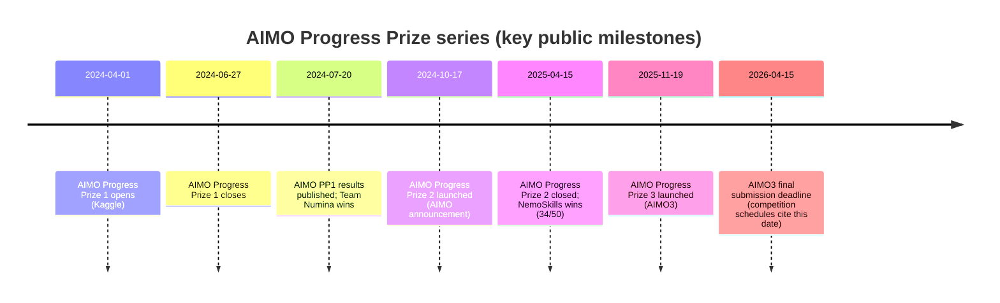
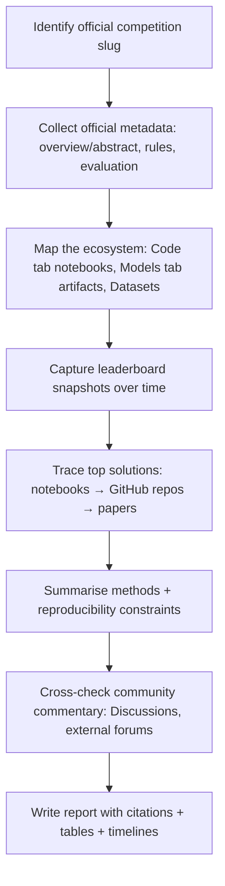

# Deep Research Report on Kaggle’s AIMO 3 Competition

## Executive summary

AI Mathematical Olympiad – Progress Prize 3 (“AIMO 3”) is a **Featured Code Competition on Kaggle** whose stated goal is to “solve international-level math challenges using artificial intelligence models,” with **Prizes & Awards listed as $2,207,152** on Kaggle’s overview/abstract metadata. citeturn24search15turn21search13 The competition is part of the wider **AIMO Prize programme funded by XTX Markets**, a $10m challenge fund intended to spur development of publicly shared AI systems capable of gold-medal performance at IMO-level standards. citeturn25search15turn24search23

AIMO has run prior “progress prize” Kaggle competitions. The **first** ran **1 April–27 June 2024**, had a **$1.048m** pool, and was won by **Team Numina**. citeturn20search10turn9search27turn12search26 The **second** concluded in **April 2025** and was won by **Nvidia’s team “NemoSkills”** with **34/50** on the final Kaggle leaderboard. citeturn24search25turn21search14 AIMO’s own updates and analyses emphasise a persistent gap between closed commercial systems and open solutions; the AIMO 3 launch write-up highlights (for AIMO 2) that commercial models could solve far more of the public set than the best Kaggle teams, framing AIMO 3 as an attempt to close that gap. citeturn12search3turn12search11

For AIMO 3 specifically, **publicly shared notebooks demonstrate scores in the low-to-mid 40s out of 50** (e.g., multiple notebooks explicitly titled **[44/50]**), while other prominent technical notebooks document **high-scoring approaches around ~39/50** using Tool-Integrated Reasoning (TIR) and Python execution. citeturn25search2turn10search0turn25search10 A **44/50 public score does not imply the overall problem is “solved”** in any robust sense: historically (AIMO 2 rules), the “Overall Progress Prize Winner” required **≥47/50 on both public and private test sets**, and AIMO-style competitions always include a hidden private split and strong incentives against overfitting/instability. citeturn2search5turn25search23

Practically, AIMO 3 has evolved into a **systems engineering competition**: participants grapple with **offline execution (internet off), dependency pinning, vLLM packaging, tool-call frameworks, and runtime constraints**. This is reflected both in Kaggle discussion topics (exceptions, vLLM availability) and in “utility notebooks” devoted purely to reproducible builds for the submission environment. citeturn24search16turn25search9turn21search5turn22search10 An ecosystem of open repos and datasets supports competitors, including the AIMO 1 winning repo (Project Numina), AIMO 2 2nd place repo (imagination-research), and AIMO 3-specific datasets and training corpora shared on Hugging Face. citeturn12search26turn9search13turn12search29turn12search18

## Official competition page(s) and rules

### Official competition pages

The canonical competition is hosted on Kaggle as **“AI Mathematical Olympiad – Progress Prize 3”** (slug: `ai-mathematical-olympiad-progress-prize-3`). citeturn21search13turn10search15 Kaggle’s overview/abstract metadata (as accessible via crawled text) indicates:

- Competition type: **Featured Code Competition** (implied by the “Code Competition” framing and required notebook-style submission mechanics visible across official/utility notebooks). citeturn24search15turn20search8  
- Prize listing: **Prizes & Awards $2,207,152**. citeturn24search15  
- Metadata includes “Start … Close …”, participation counts, and tags (including **Custom Metric**). citeturn24search15turn25search11

AIMO’s own programme page explicitly links out to **“AIMO3 on Kaggle: Rules and Leaderboard”** and situates AIMO 3 as the third progress prize launched in **November 2025**. citeturn21search14turn20search10turn24search0

### What the competition is asking you to do

Although the full Kaggle “Rules” page text was not reliably retrievable in the crawled material, the required mechanics and data format are strongly evidenced by:

- The competition dataset structure used by participant notebooks: e.g., reading `reference.csv`, `test.csv`, and `sample_submission.csv` from the competition input path. citeturn10search16  
- The “AI hard” / Olympiad-level problem framing in AIMO materials and third-party summaries: AIMO 3 is described as pushing difficulty toward IMO-standard reasoning. citeturn24search24turn25search11turn24search0  
- The answer form: AIMO 3 datasets and tooling references constrain answers to **non-negative integers**, and AIMO 3 dataset construction notes explicitly filter to answers in **[0, 99999]**. citeturn0search12turn10search16  

### Submission and evaluation mechanics

AIMO competitions are “code competitions” in practice: your submitted notebook runs in Kaggle’s environment and interacts with a provided inference/evaluation server framework. Evidence includes:

- Explicit mention (in notebook script content) of an inference server that calls `serve()` for real evaluation or a “local gateway” in offline testing. citeturn10search12  
- Community and repo guidance that Kaggle runs your code against a hidden test set (and that it can take hours), and that **internet must be OFF** for submissions. citeturn20search8turn21search5  
- Notes on dependency management under **no internet** constraints (and the need for “utility notebooks” to pre-install packages into `/kaggle/working`). citeturn21search5turn22search10  

AIMO 3 appears to use an evaluation setup that can produce fractional points (0/0.5/1.0) in at least some competitor discussions/repos, consistent with “double-run” style scoring common in agentic code competitions (run twice; 1.0 only if stable). citeturn17search31

## Timeline, past competition results, cash prize, and prize distribution

### Programme context and prior results

AIMO Prize programme framing (XTX Markets) and the progress-prize series are described on AIMO’s official site. citeturn25search15turn20search10 Key milestones:

- **AIMO Progress Prize 1**: Open **1 April–27 June 2024**; prize pool **$1.048m**; prizes distributed July 2024 at IMO 2024 (Bath, UK). citeturn20search10turn9search27  
  - Winner: **Team Numina**. citeturn9search27turn12search26turn25search17  
- **AIMO Progress Prize 2**: Concluded **April 2025**; winner **NemoSkills** with **34/50**. citeturn24search25turn22search11  
  - AIMO’s participate page describes NemoSkills as **Nvidia’s team**, a concrete example of large-company participation. citeturn21search14  
  - AIMO’s “gap is shrinking” analysis compares OpenAI’s o3-preview against NemoSkills and imagination-research (2nd place), reinforcing that AIMO 2 had a strong competitive field but still lagged behind closed systems. citeturn12search11  
- **AIMO Progress Prize 3 (AIMO 3)**: Launched **November 2025** and described as raising difficulty and increasing the prize pot. citeturn24search0turn21search14turn12search3  

### AIMO 3 dates and deadline structure

A third-party competition index summarises AIMO 3 as: **Start 20 Nov 2025**, **Entry/Team Merger deadline 8 Apr 2026**, **Final submission 15 Apr 2026**. citeturn25search11 This aligns with CLIST’s event date shown as **April 15, 2026** and “time remaining” as of early March 2026. citeturn26view0turn27view1

Kaggle’s own overview/abstract snippet exposes the relative timing (“Start … Close …”) but not a fully parsed UTC timestamp in the captured text. citeturn24search15

### Prize pool and prize distribution

**AIMO 3: prize pool**  
Kaggle’s metadata lists **Prizes & Awards: $2,207,152** for AIMO 3. citeturn24search15turn7search18 AIMO’s announcement frames the third progress prize as **“$2.2 million”** (rounded), consistent with Kaggle’s precise figure. citeturn24search0turn21search14

**AIMO 3: prize distribution**  
The exact AIMO 3 payout tiers were **not explicitly visible** in the retrievable Kaggle rules text in the crawled sources provided here, so the precise distribution should be treated as **unspecified in this report**.

However, the **AIMO 2 competition rules** (on Kaggle) provide a clear template for how the series has worked financially:

- Total fund (AIMO 2): **$2,117,152**  
- Fixed prizes for top 5 teams: **$262,144 / $131,072 / $65,536 / $32,768 / $16,384**  
- After the top-5 awards, the remainder goes to an “Overall Progress Prize Winner” defined as the **highest ranking team achieving ≥47/50 on both public and private test sets**; otherwise, the remainder rolls over. citeturn2search5  

Given that AIMO 3 is explicitly “building on” earlier progress prizes, it is plausible (but not confirmed here) that AIMO 3 uses a similar “top-5 + remainder for threshold winner” structure. citeturn21search14turn12search3

### Mermaid timeline of the AIMO progress-prize series



Sources for the dated milestones: AIMO PP1 dates and prize pool citeturn20search10; PP1 results date and winner citeturn9search27; PP2 closed and winner citeturn24search25; AIMO3 launch citeturn24search0turn12search3; AIMO3 close date citeturn25search11turn26view0.

## Leaderboard history, top entries, solo vs team performance, and what a “44” means

### Leaderboard history: what’s available and what isn’t

Kaggle’s native UI shows the current standings, but it does not provide a built-in “full leaderboard over time” export in the materials captured here. Community workarounds include:

- A Kaggle dataset explicitly titled **`aimo3-public-leaderboard`**, suggesting a community-maintained snapshot/archive of public standings. citeturn22search3turn21search12  
- An external “AIMO3 Leaderboard Monitor” site, indicating that at least one competitor attempted to track leaderboard changes programmatically. citeturn20search0  

Because the contents of those trackers were not retrievable in the current crawled text, the “full leaderboard history” in this report is necessarily partial: we can document **(a)** an early snapshot from an external standings aggregator, and **(b)** evidence of much higher scores later via “score-in-title” notebooks.

### A useful (but stale) snapshot: CLIST standings

CLIST hosts a standings table for the Kaggle competition and shows an “updated … ago” indicator. In the crawled snapshot, CLIST reports it was **last updated ~3 months** prior, implying it may reflect *early competition performance*, not the present state. citeturn27view2turn26view0

Even so, it provides a concrete early “top ranks and handles” list. The top 10 (at the time CLIST last updated) were:

| Rank | Display name / handle | Score (as shown) | Solo/team | Link | Notes |
|---:|---|---:|---|---|---|
| 1 | Yi‑Chia Chen (`threerabbits`) | 23 | Unspecified (appears solo) | CLIST → Kaggle handle citeturn27view2 | CLIST update is stale citeturn26view0 |
| 2 | Patrick Chan (`drpatrickchan`) | 13 | Unspecified (appears solo) | citeturn27view2 |  |
| 3 | surya milenial (`suryamilenial`) | 10 | Unspecified (appears solo) | citeturn27view2 |  |
| 4 | Lerchen Zhong (`lerchenzhong`) | 10 | Unspecified (appears solo) | citeturn27view2 |  |
| 5 | Jeki Wan Taufik (`jekiwantaufik`) | 9 | Unspecified (appears solo) | citeturn27view2 |  |
| 6 | Hossein (`tomi85`) | 9 | Unspecified (appears solo) | citeturn27view2 |  |
| 7 | Dipankar Mitra (`dipankarthekohda`) | 9 | Unspecified (appears solo) | citeturn27view2 |  |
| 8 | Ayman Hamed (`ayman3000`) | 8 | Unspecified (appears solo) | citeturn27view2 |  |
| 9 | Yone (`theunforgiven7`) | 8 | Unspecified (appears solo) | citeturn27view2 |  |
| 10 | today (`today`) | 8 | Unspecified (appears solo) | citeturn27view2 |  |

**Public/private gap:** not available in CLIST’s crawled table. citeturn27view2  
**Submission links:** Kaggle code competitions typically do not expose per-submission downloadable artefacts for other teams; the stable public link is usually a team/handle page or a public notebook. (Hence the handle-based links above.) citeturn27view2  

### Evidence of later progress: public notebooks with 39/50 and 44/50

Multiple public Kaggle notebooks explicitly claim **high public leaderboard scores**:

- **“[39/50] AIMO3: Condition Mining + TIR w/ python”** reports **Public Score 36, Best Score 39**, suggesting iterative improvements and a near-40 public LB solution. citeturn10search0  
- Multiple notebooks are titled **“[44/50] …”**, strongly implying that at least some competitors reached **44/50** on the public leaderboard at some point. Examples include:  
  - “**[44/50] AIMO3: Skills optional, Luck required**” citeturn25search2  
  - “**[44/50] Skill Optional, Luck Zaroori**” citeturn25search10  

There is also a GitHub repository containing a notebook file named with **44/50** in the filename, reinforcing that “44” is a real achieved milestone for at least some participants. citeturn25search5

### Solo competitors vs teams

From the CLIST snapshot, the **top ranks appear to be dominated by apparent single-person profiles** (single handle per row). citeturn27view2 A multi-handle row does appear lower in the table (showing two handles separated by a delimiter), demonstrating that teams exist, but not that they dominate at the very top (at least in this early snapshot). citeturn26view0

Given AIMO 3’s heavy engineering burden—offline packaging, runtime control, tool execution, long inference windows—it is structurally plausible that small teams may have an advantage later in the competition, but the publicly visible evidence in this crawl points to **strong individual contributors** publishing many of the key enabling notebooks and tooling. citeturn21search5turn22search10turn20search6turn10search0

### Does a 44 score imply the problem is “solved”?

A **44/50 public leaderboard score** should *not* be interpreted as “problem solved” for several reasons:

1. **Historical “win condition” is higher and requires private generalisation.** In AIMO 2, the rules define an “Overall Progress Prize Winner” as the highest ranking team achieving **≥47/50 on both public and private test sets**. citeturn2search5 Even if AIMO 3 uses a different threshold (not confirmed here), AIMO’s own framing expects a significant remaining gap to close. citeturn12search3turn24search24  
2. **Public ≠ private.** AIMO competitions use a public leaderboard split and a hidden private split; success on public can reflect overfitting to that subset, especially if competitors do any form of adaptive tuning to public feedback. (AIMO’s emphasis on “AI hard” and original problems is partly meant to resist contamination and memorisation.) citeturn25search11turn12search3  
3. **Stability matters in agentic runs.** Some competitor pipelines optimise for verification and stability (and explicitly reference a 0/0.5/1.0 scheme), suggesting that reproducibility under multiple runs is a deliberate part of the evaluation environment. citeturn17search31  

**Bottom line:** 44/50 is a major engineering and modelling achievement, but it is still meaningfully below the historical “47/50 public + 47/50 private” bar and does not demonstrate that the broader benchmark is fully cracked. citeturn2search5turn25search2

## Notable models/methods and top notebooks

### What tends to work in AIMO-style competitions

Across AIMO 1–3, the dominant pattern is **LLM reasoning + tool use + verification**:

- **Tool-Integrated Reasoning (TIR)** and **self-consistency with code execution feedback** were central to Team Numina’s AIMO 1-winning approach, including a fine-tuning recipe for a math-specialised base model (DeepSeekMath-Base 7B) and decoding/selection strategies that leverage executable tools. citeturn12search26turn25search17  
- AIMO 3 competitor tooling strongly suggests a similar “agentic + tools” approach at higher difficulty: many notebooks and repos revolve around **vLLM**, offline packaging, and structured tool-call frameworks (e.g., “Harmony”), indicating that tool use is not optional at the top end. citeturn22search10turn24search6turn20search6  
- Some competitors also pursue **“SymPy-first” deterministic solving pipelines**, using the LLM primarily for translation/structuring while relying on symbolic computation and rigorous verification to prevent hallucinated answers. citeturn17search31turn10search16  

Concrete examples of models and stacks seen in AIMO 3 artifacts include **GPT‑OSS‑20B / GPT‑OSS‑120B** served via **vLLM**, with parallel attempts, majority voting, and sandboxed Python execution. citeturn24search6turn10search17turn22search10

### Top notebooks table (selected, high-signal)

The competition’s “top notebooks” can be defined in two pragmatic ways: (i) notebooks with high public score claims, and (ii) foundational notebooks that the community repeatedly copies/forks to get a valid submission pipeline.

| Notebook | Author (Kaggle) | Evidence of impact | Approach summary | Key algorithmic ideas / snippets |
|---|---|---|---|---|
| **AIMO 3 Submission Demo** | Ryan Holbrook | Widely referenced “submission demo” notebook | A working end-to-end submission scaffold for the inference server pattern used in the competition. citeturn10search18 | Uses the competition’s inference server API pattern (serve vs local gateway) consistent with other scriptcontent traces. citeturn10search12turn10search18 |
| **AIMO 3 Submission Demo Notebook 2/2** | SIMON FRIEDER (`friederrr`) | Referenced in Kaggle troubleshooting discussions | Follow-up demo; commonly used as a base but can produce runtime exceptions if modified incorrectly. citeturn10search3turn24search16 | Emphasises robust notebook submission mechanics and environment constraints. citeturn24search16 |
| **pip-install-aimo3** | ShelterW (copied from Tong Hui Kang) | Addresses a core bottleneck: offline dependencies | Documents the “utility notebook” mechanism to pre-install pinned dependencies into `/kaggle/working` with internet enabled *outside* the submission run. citeturn21search5 | Core idea: pre-build the environment; link as “Add Input” into the submission notebook. citeturn21search5 |
| **pip-install-aimo3.2** | Tong Hui Kang (`huikang`) | Updated/personalised dependency workflow | A concrete install script that uninstalls conflicting packages, then installs **vllm==0.13.0** and tool-call dependencies into `/kaggle/working`, including tokenizer encoding files. citeturn22search10turn22search14 | Example (abbrev): install into `/kaggle/working`, manage tokenizer encoding artefacts. citeturn22search10 |
| **[39/50] AIMO3: Condition Mining + TIR w/ python** | `parthenos` (copied from Andreas Bisiadis) | High-score public notebook | Reports **Best Score 39**; signals a high-performing hybrid: mine constraints/conditions + execute Python tools (TIR) to validate candidates. citeturn10search0 | “Condition mining” + tool execution; likely multi-attempt + verification loop. citeturn10search0 |
| **AIMO 3 Baseline – w/ python** | `shelterw` | Baseline starter | A baseline illustrating Python-based reasoning and parsing patterns; useful for framing I/O and minimum viable inference loop. citeturn10search2 | Baseline parsing and simple solve loop (details not fully visible in crawl). citeturn10search2 |
| **AIMO3 – FINE-TUNING PIPELINE** | `junaid512` | Training-oriented | Indicates a pipeline direction toward SFT/LoRA fine-tuning for the competition format under constraints. citeturn10search7 | Suggests a structured fine-tuning workflow; aligns with AIMO series emphasis on openly shared models. citeturn25search15turn10search7 |
| **AIMO 3 \| GPT‑OSS‑20B (with tools)** | `wangchengke123` | “Model-specific recipe” | A model-focused notebook indicating use of GPT‑OSS weights with tool-use scaffolding. citeturn10search17 | Reinforces trend: larger open models + tool execution are central. citeturn10search17turn24search6 |
| **[44/50] AIMO3: Skills optional, Luck required** | `nihilisticneuralnet` | Evidence of 44/50 milestone | Public notebook explicitly titled **[44/50]**, signalling a high public LB achievement. citeturn25search2 | Likely builds on TIR + sampling; title suggests variance/luck sensitivity (common in agentic sampling). citeturn25search2 |
| **AIMO 3 Submission Evolved** | Sera Ria Gomes (copied from Ryan Holbrook) | Illustrative alternate strategy | Shows a “pure algorithmic” solver stance using **SymPy** and scientific Python, loading `reference.csv` and `test.csv`. citeturn10search16 | Emphasises symbolic math imports and offline computation rather than LLM inference. citeturn10search16turn17search31 |

#### Minimal “key snippet” examples (small excerpts, paraphrased)

A frequent reproducibility trick is installing into `/kaggle/working` in a utility notebook, then attaching that directory as an input to a submission notebook. This is explicitly motivated by **no internet during submissions** and constraints around runtime restarts. citeturn21search5turn22search10

A representative install pattern (abbreviated) looks like:

```python
# Utility notebook idea: install deps into a folder you can attach as an input
%pip install --target=/kaggle/working vllm==0.13.0 pandas polars
```

(Shown here as an illustrative skeleton; the fully worked version also manages package conflicts and tokeniser artefacts.) citeturn22search10turn21search5

### Related datasets and external benchmarks used by top approaches

AIMO 1’s winning repository documents using **external validation sets** (AMC, AIME, MATH) to guide selection and reduce leaderboard overfitting. citeturn12search26turn24search11 This pattern persists as community infrastructure:

- Hugging Face hosts the **AIMO Progress Prize collection**, including **NuminaMath-7B-TIR** and validation datasets (AIME/AMC/MATH levels). citeturn24search11  
- A Hugging Face dataset titled **“AIMO3 Math Dataset”** contains **CoT** and **TIR** examples for training, attributed to an AIMO 3 competitor. citeturn12search29  
- The **AIMO-CMU-MATH** repo describes datasets and scripts (AIME/AMC/Odyssey-Math, reward model and policy model training artefacts), positioning itself as “beneficial for … preparation for the next round of AIMO.” citeturn12search18  
- Kaggle also hosts datasets “in AIMO format” for fine-tuning workflows, indicating an ecosystem of re-formatted math corpora. citeturn12search23  

## Community sentiment, commentary, company participation, and reproducibility

### Themes in Kaggle discussions and notebooks

Representative Kaggle discussion snippets show recurring issues:

- **“Notebook threw exception” / debugging the submission demo**: participants often start from official demo notebooks, then hit brittle runtime errors when adapting them. citeturn24search16  
- **vLLM dependency pain**: a discussion explicitly requests making vLLM built-in, arguing it would save time—evidence that environment friction is a major concern. citeturn25search9  
- **Offline dependency workflow as a shared community pattern**: the “pip-install-aimo3” notebooks are essentially documentation for how to survive without internet and still ship vLLM/tool stacks. citeturn21search5turn22search10  

AIMO’s own “gap is shrinking” update suggests the community has been “lively” and that the organisers actively solicited suggestions for improving the competition format going into AIMO 3. citeturn24search24

### Company participation and sponsorship signals

There are two distinct notions of “big company participation”:

- **As competitors**: AIMO states that **AIMO 2 was won by Nvidia’s team NemoSkills**, demonstrating direct “big tech” style participation in the series. citeturn21search14turn24search25  
- **As funders/partners**: The programme is funded by **XTX Markets** (large proprietary trading firm) and AIMO 3 is framed as having increased compute resources and partnerships; third-party summaries mention compute/API credit partners (Fields Model Initiative, Thinking Machines). citeturn25search15turn21search14turn25search11  

### What happened to top teams since (AIMO 1 and AIMO 2)

Because **AIMO 3 is still ongoing** (deadline mid-April 2026), it is not meaningful to describe “what happened since” for AIMO 3 winners; they are not yet determined. citeturn26view0turn25search11

For **earlier rounds**, there is clear evidence of continued open work:

- **Project Numina (AIMO 1 winner)** published a detailed reproducibility repository describing the training/inference recipe, including TIR and self-consistency decoding, plus curated validation sets to avoid overfitting. citeturn12search26turn25search17  
- **AIMO 2 ecosystem** includes open solution writeups like the **imagination-research (2nd place) repository**, which documents their approach and assets. citeturn9search13turn12search11  
- Post-competition analysis includes **AIMO × OpenAI evaluations** using an unreleased “o3-preview” model on AIMO 2 sets, indicating that the competition outcomes have become a benchmark for broader model comparisons. citeturn12search11turn12search3  

### Reproducibility and code availability

AIMO’s incentive design explicitly targets **publicly shared** models and methods in service of an open IMO-level benchmark. citeturn25search15turn9search20 In the AIMO 3 competitor ecosystem, reproducibility is shaped by constraints:

- **Internet-off submissions** are treated as a hard norm; notebooks repeatedly stress this. citeturn21search5turn20search8  
- Reproducibility therefore depends heavily on:
  - **Pinned dependencies** and “utility notebooks” for packaging. citeturn21search5turn22search10  
  - Rigorous verification in solver pipelines (e.g., “SymPy-first”, constraint checking). citeturn17search31turn10search16  
  - External/open repos providing end-to-end pipelines (e.g., template code for serving vLLM; large-model pipelines using GPT‑OSS with tool frameworks). citeturn20search6turn24search6  

## How to research Kaggle effectively for AIMO 3

### A practical research workflow



Key AIMO 3 entry points to start from:

- Kaggle competition page and abstract (prize, timing, participation signals). citeturn21search13turn24search15  
- The Code tab (often queryable with sort parameters in the URL, e.g. score-descending). citeturn23search1  
- Foundational submission-demo and dependency notebooks. citeturn10search18turn21search5turn22search10  

### Kaggle API / CLI: command patterns you’ll want

Below are *typical* commands used with Kaggle’s official CLI (“kaggle” Python package). Because Kaggle’s API documentation text was not retrievable in the current crawl, **treat syntax as illustrative and verify against Kaggle’s current docs**.

```bash
# Authenticate (typical pattern)
# 1) Place kaggle.json API token in your local Kaggle config directory
# 2) Lock permissions, then test:
kaggle --version

# List competitions and filter
kaggle competitions list | grep -i "olympiad"

# Fetch competition files (where permitted)
kaggle competitions download -c ai-mathematical-olympiad-progress-prize-3

# List your submissions (useful for experiments / ablations)
kaggle competitions submissions -c ai-mathematical-olympiad-progress-prize-3

# Pull the current leaderboard snapshot (useful for history tracking)
kaggle competitions leaderboard -c ai-mathematical-olympiad-progress-prize-3
```

If your goal is “leaderboard history”, schedule the leaderboard command daily and append to a CSV/Parquet log (store timestamp, rank, team name, score). This recreates what community trackers and datasets appear to provide. citeturn22search3turn20search0

### Scraping Kaggle discussions/comments: limitations, ethics, and tools

AIMO 3 research is often impeded by modern, JS-heavy pages and intermittent “page crashed” behaviour in crawled outputs (especially for the Code tab and some datasets). citeturn23search1turn22search3 Practically:

- Prefer **official APIs** (when available) and **public notebook exports** over HTML scraping.
- If you must scrape:
  - Use conservative request rates and caching.
  - Scrape only what you need (e.g., discussion titles, authors, timestamps, and a short excerpt).
  - Respect robots/terms and avoid bypassing access controls.

Recommended tooling stack (typical):

- **API-first**: Kaggle CLI / Kaggle Python client for leaderboards, submissions, and downloads.
- **HTML parsing**: `requests` + `BeautifulSoup` for static pages.
- **Browser automation**: Selenium (or Playwright) for click-to-load pages, infinite scroll, and pages requiring client rendering.

### Example: lightweight leaderboard-history collector (Python)

```python
"""
Illustrative script: run `kaggle competitions leaderboard ...` daily,
parse into a table, and append to a history CSV for later analysis.
"""

import subprocess
import datetime
import csv
from pathlib import Path

COMP = "ai-mathematical-olympiad-progress-prize-3"
OUT = Path("aimo3_leaderboard_history.csv")

def run_leaderboard():
    # Capture CLI output (exact flags may differ; verify in current Kaggle CLI)
    result = subprocess.run(
        ["kaggle", "competitions", "leaderboard", "-c", COMP],
        check=True,
        capture_output=True,
        text=True,
    )
    return result.stdout

def parse_leaderboard(text: str):
    # NOTE: Kaggle CLI output formats can change. Implement robust parsing.
    rows = []
    for line in text.splitlines():
        # Heuristic: skip headers, keep rank lines
        if not line.strip() or line.lower().startswith("rank"):
            continue
        # Implement your parsing logic here.
    return rows

def append_snapshot(rows):
    ts = datetime.datetime.now(datetime.timezone.utc).isoformat()
    is_new = not OUT.exists()
    with OUT.open("a", newline="", encoding="utf-8") as f:
        w = csv.writer(f)
        if is_new:
            w.writerow(["timestamp_utc", "rank", "team", "score"])
        for r in rows:
            w.writerow([ts, r["rank"], r["team"], r["score"]])

if __name__ == "__main__":
    text = run_leaderboard()
    rows = parse_leaderboard(text)
    append_snapshot(rows)
    print(f"Wrote {len(rows)} rows to {OUT}")
```

### Reproducible AIMO 3 research environment: what to standardise

AIMO 3 is unusually sensitive to environment drift. Standardise:

- **Offline constraints**: plan for “internet off” submission runs; use utility notebooks to build dependencies. citeturn21search5turn20search8  
- **Pinned versions**: vLLM and tool frameworks are version-sensitive; competitor notebooks explicitly pin versions and uninstall conflicting packages. citeturn22search10turn21search5  
- **Inference server contract**: structure your notebook around the competition’s gateway/serve pattern for local testing vs submission evaluation. citeturn10search12turn10search18  
- **Verification-first scoring**: many higher-end pipelines emphasise validation/constraint checks (symbolic or execution-based) to avoid “hallucinated integer” answers. citeturn17search31turn10search16  

### AIMO 3-specific research tip: treat notebooks as “papers”, repos as “implementations”

In this ecosystem, the most reliable “primary sources” are:

- Kaggle notebooks (often under permissive licences; many explicitly state Apache 2.0). citeturn10search0turn21search5turn10search16  
- GitHub repos that package full pipelines and document constraints (e.g., template code, GPT‑OSS tool-use solvers). citeturn20search6turn24search6  
- AIMO’s own updates, which provide authoritative series-level context, winners, and evaluations. citeturn9search27turn24search25turn12search11turn24search0  

This “notebook-first” approach is also consistent with the programme’s ethos: the goal is not only leaderboard performance, but publicly shared progress toward IMO-level open mathematical reasoning. citeturn25search15turn9search20