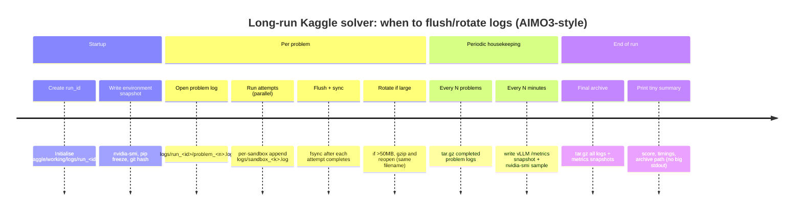
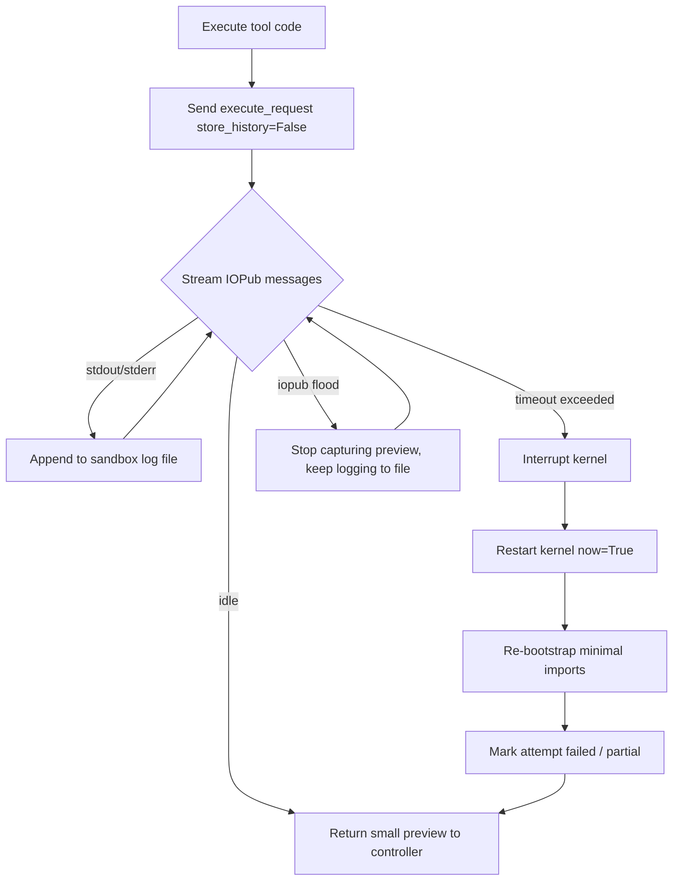

# Preventing Kaggle Notebook OOM in AIMO3-Style Solver Submissions

## Executive summary

Your failure mode is a classic **“post-run OOM”**: the notebook *solves successfully*, but **Kaggle’s rendering/post-processing step** (commonly associated with notebook conversion to an artefact view) runs out of memory because the notebook has accumulated **massive cell outputs**, particularly **stdout-heavy solver logs** (HiGHS MILP branch-and-bound can produce extremely verbose logs). This is consistent with how notebooks store outputs inside the `.ipynb` JSON and how conversion tools like `nbconvert` operate largely **in-memory**. citeturn9view0turn16search2

The practical fix is not “more RAM” or “fewer attempts” first; it is **preventing notebook-output bloat**:

- **Never print large logs to notebook stdout** (including from tool sandboxes). Write logs to **files in `/kaggle/working`** and keep only **small previews** in the notebook. Kaggle explicitly allows saving notebook output files to `/kaggle/working` (up to a stated limit). citeturn18search3  
- For HiGHS specifically, set **`log_to_console=False`** and a **`log_file`**; optionally also control `output_flag`. These options are documented by HiGHS. citeturn16search2turn16search15  
- Treat tool timeouts as “kernel may be poisoned”: **restart the sandbox kernel** on timeout to prevent runaway native processes continuing to burn CPU or spew logs. (Interrupt is not reliably sufficient when subprocesses misbehave; restarting is a common resolution path.) citeturn12search2turn12search32  
- Reduce long-run memory creep: execute tool code with **`store_history=False`** (to avoid IPython history accumulation) and periodically clear references; IPython explicitly documents `store_history` for `run_cell`, and IPython output caches are known to contribute to memory growth. citeturn13search0turn12search19  

On H100 + vLLM, focus monitoring on: (a) **GPU KV cache pressure** (`vllm:kv_cache_usage_perc`) and request state gauges (`vllm:num_requests_running`, `...waiting`, `...swapped`), and (b) whether you’re seeing **preemptions** (vLLM tuning docs explicitly recommend monitoring preemption requests via Prometheus metrics). citeturn0search2turn17search0  

## Why “OOM” happens at submission time versus during the run

### Post-processing OOM during submission or “Save & Run All”

In Kaggle, a “Save & Run All”/commit-like run executes the notebook from a clean session and then prepares results for display and reuse. Kaggle states (quote): **“Save & Run All creates a new session with a completely clean state and runs your notebook from top to bottom.”** citeturn19search2 This behaviour makes it easy to reproduce issues that *don’t show up* in interactive mode.

The core technical reason output bloat becomes catastrophic is that notebook conversion tooling (commonly `nbconvert` in Jupyter ecosystems) is designed to run pipelines in memory. `nbconvert` documentation explicitly notes (quote): **“nbconvert has been designed to work in memory…”** citeturn9view0 That means if your notebook JSON contains huge outputs (stdout text, rich displays, embedded images), the conversion step can require large RAM spikes.

Two specific amplifiers matter for AIMO3-style solvers:

- **Stdout-heavy solvers** (e.g., MILP branch-and-bound logs) can generate megabytes-to-gigabytes of text. If printed to notebook output, it is stored in the `.ipynb` and must be processed later. Community experience across Jupyter supports this: very large saved outputs can render notebooks hard to open and require output clearing. citeturn8search6turn14search4  
- **Rich display outputs** (dataframes, images) can also balloon notebook size. `nbconvert` documentation highlights that HTML export can embed figures as base64 by default (quote): **“leaves the figures as embedded base64”** unless configured to extract them. citeturn9view0  

### “Real” OOM during the run

This is the more familiar case: your process runs out of RAM/VRAM during execution. For AIMO3 solver notebooks, typical runtime OOM causes include: accumulating conversation/attempt logs in Python data structures, IPython input/output caching, and long-running native processes. IPython’s caching and history mechanisms are real; IPython documents “input and output caching” (In/Out history), and output-history memory behaviour has been the subject of bug reports. citeturn12search30turn12search19  

For vLLM on H100, runtime OOM-like failures are often actually **KV cache pressure leading to preemptions** rather than a hard CUDA OOM; vLLM’s optimisation docs explicitly connect tuning KV cache availability and monitoring preemption requests via Prometheus metrics. citeturn17search0turn0search2  

## Kaggle constraints and behaviours that matter most

Kaggle’s documentation is not a single authoritative “limits table” for every accelerator across all competitions (so some exact RAM/CPU figures are best treated as environment-dependent), but several critical constraints are explicitly documented:

Kaggle states (quote): **“Up to 20 GBs of output from a Notebook may be saved to disk in /kaggle/working.”** citeturn18search3 This is your main lever for preserving logs *without* bloating notebook cell outputs: write logfiles to `/kaggle/working` and download them from the Output files after the run, rather than printing.

Kaggle also documents a hard execution-time constraint for “save successfully” workflows: (quote) **“the entire Notebook must execute within 12 hours (9 hours for TPU notebooks).”** citeturn7search2 This matters because output bloat problems often only manifest near the end of long runs (when the conversion step begins).

Finally, Kaggle reiterates the clean-session semantics of commit-style runs (quote): **“Save & Run All creates a new session with a completely clean state…”** citeturn19search2 For AIMO3 notebooks, that means your logging and sandbox initialisation must be robust from zero state.

About H100 specifically: Kaggle’s official docs do not (in the sources retrieved here) provide a stable public statement of “H100 availability/limits,” but AIMO3 community template guidance explicitly instructs selecting “GPU H100” for Kaggle submissions. Treat this as **community report** rather than official platform documentation. citeturn15search1  

## Preventing notebook-output bloat with Kaggle-friendly logging

### Principles that work reliably on Kaggle

The goal is to keep the **`.ipynb` output JSON small**, while still preserving full-fidelity diagnostics.

Keep notebook stdout to lightweight status lines, and send all heavy logs to files. This is the same philosophy behind advice to clear outputs for “giant notebooks” when they become unwieldy. citeturn14search0turn8search13  

Use `/kaggle/working` for log files because it is the documented location for saveable notebook outputs. citeturn18search3  

### Concrete techniques

Stream logs to files (append-only), and truncate what you display/return in notebook cells. This applies both to your main process logs and (critically) to your **tool sandbox stdout**.

Avoid `display(df)`/large dataframe rendering in long runs. Notebook conversion has to serialise those outputs. (This is not Kaggle-specific; it is a Jupyter output-size reality, and is consistent with reports of notebooks becoming unusable when outputs are huge.) citeturn8search6turn14search14  

Gate verbosity with flags (`verbose=False` by default in submission mode), and only enable full console debugging in short local/interactive verification runs.

### HiGHS-specific logging controls

HiGHS exposes explicit options to control output:

- `output_flag`: “Enables or disables solver output”
- `log_to_console`: “Enables or disables console logging”
- `log_file`: “Log file” citeturn16search2  

HiGHS also documents how to set options programmatically in Python via `setOptionValue(name, value)`. citeturn16search15  

That means you can preserve complete logs **without printing**:

```python
import highspy
from pathlib import Path

log_path = Path("/kaggle/working/highs_logs") / "problem_001_highs.log"
log_path.parent.mkdir(parents=True, exist_ok=True)

h = highspy.Highs()

# Keep output off the notebook console:
h.setOptionValue("log_to_console", False)
# Write to file instead:
h.setOptionValue("log_file", str(log_path))

# Optional: if you want absolutely minimal solver output, disable output globally.
# (Be careful: depending on build/usage, you may still want a file log.)
h.setOptionValue("output_flag", True)   # keep file logging enabled
# h.setOptionValue("output_flag", False)  # aggressive: disable solver output
```

If you need to limit CPU disruption, HiGHS has a `threads` option (0 = automatic). citeturn16search2 For Kaggle notebooks running vLLM concurrently, setting `threads` to a small number for MILP attempts can prevent CPU saturation and secondary failures (timeouts elsewhere). (This “prevent interference” reasoning is experience-based; exact optimal value is workload-dependent and should be validated in your environment.)

## Sandbox and kernel management for long-running tool-integrated solvers

### Why restart-on-timeout is often the correct policy

Kernel interrupt is not a guaranteed “kill switch” for all failure modes. Community reports and long-lived issues note that when subprocesses are involved, interrupt may not terminate them cleanly, leaving the kernel in a bad state; “restart the kernel” is commonly the resolution. citeturn12search2turn12search32  

For AIMO3-style notebooks where the model might spawn MILP solvers, a solid rule is:

- **Timeout → interrupt → restart kernel → re-bootstrap environment**
- Treat the attempt as failed/partial, but preserve logs to file.

### Controlling IPython history growth

IPython documents that `store_history` controls whether executed code is stored in IPython history; in IPython’s `run_cell` docs (quote): **“If True… stored in IPython’s history… should be set to False”** for user code calling back into IPython machinery. citeturn13search0  

This matters because storing lots of code and outputs can bloat memory during long runs, and output caches are a known contributor to memory growth patterns. citeturn12search19turn12search30  

Also note: clearing output caches doesn’t always immediately free memory in all scenarios (report/issue context), so prevention (`store_history=False`, minimal outputs) tends to be more reliable than cleanup after the fact. citeturn12search19  

### Safe pool replacement patterns

For parallel sandboxes, you need defensive “return to pool” logic: if reset fails, replace the sandbox instance so concurrency doesn’t degrade over time. (This is an engineering best practice; not something with a single authoritative doc source. Marked as **unspecified**.)

### IOPub pressure and “too much output”

Jupyter has rate-limiting and output-channel constraints; “IOPub data rate exceeded” is a known symptom when output volumes are huge, and typical fixes involve limiting output or adjusting server config. citeturn12search3turn12search25 In Kaggle’s managed environment, you often can’t change server config reliably, so the practical fix is: **don’t emit huge IOPub output in the first place**—capture to file, truncate previews.

## H100 utilisation and vLLM observability for Kaggle notebooks

### Metrics to monitor in vLLM

The vLLM metrics docs list these high-signal metrics:

- `vllm:num_requests_running` (and `_waiting`, `_swapped`) — request state gauges citeturn0search2  
- `vllm:kv_cache_usage_perc` — “Percentage of used cache blocks by vLLM” citeturn0search2  
- Latency histograms such as TTFT and inter-token latency (`vllm:time_to_first_token_seconds`, `vllm:inter_token_latency_seconds`) citeturn0search2  

vLLM also documents that these metrics are exposed via a Prometheus-compatible **`/metrics` endpoint** on the OpenAI-compatible API server. citeturn17search19  

For KV cache pressure and throughput tuning, vLLM’s optimisation docs explicitly recommend monitoring **preemption requests** via Prometheus metrics. citeturn17search0  

### Scraping /metrics endpoint and the 0.0.0.0 vs 127.0.0.1 nuance

vLLM examples often bind servers to `0.0.0.0` (listen on all interfaces). For client connections, `127.0.0.1` is the canonical “local host” address, while `0.0.0.0` is “unspecified”/bind-all in most contexts. citeturn19search4turn19search11  

On Linux, connecting to `0.0.0.0` as a destination can work due to kernel behaviours (community explanation: Linux may treat destination `0.0.0.0` as local/loopback-like). citeturn19search0turn19search30  

**Kaggle-specific guidance (pragmatic):** if your metrics scraper sees “all zeros,” first validate you can `curl` the endpoint and that your parser matches the actual metric names. If you control the client URL, using `127.0.0.1` is clearer and avoids edge cases across environments. (This client-choice guidance is based on networking conventions plus the Linux behaviour discussions above.)

### Avoiding stuck HTTP streams (timeouts)

If you call local vLLM via an HTTP client, ensure your HTTP stack has sensible **connect/read/write/pool timeouts**. HTTPX documents these timeout categories explicitly. citeturn8search0turn8search8  

In long AIMO3 runs, this matters because one stalled stream can block concurrency and prolong resource use. (Exact “best timeout values” are workload-dependent; treat numeric thresholds as tuning parameters.)

### Monitoring GPU/CPU/memory on Kaggle

At notebook level, `nvidia-smi` is the simplest high-signal tool.

NVIDIA describes `nvidia-smi` as a management/monitoring utility based on NVML. citeturn18search15turn18search1 NVIDIA also provides examples of “useful nvidia-smi queries” for troubleshooting. citeturn18search0  

For ongoing sampling, you can use `nvidia-smi dmon` (“device monitoring”) to emit periodic GPU utilisation/memory/power observations. citeturn18search1turn18search11  

## Implementation toolkit: code patches, diagrams, tables, checklist, action plan

### Code patch: sandbox `execute()` streaming-to-file with truncation

This pattern is designed for Jupyter-client/IPykernel-based sandboxes that consume IOPub “stream” messages. The goal: **write everything to disk**, but return only a **bounded preview** to the LLM/controller so notebook output remains tiny.

```python
from __future__ import annotations
from dataclasses import dataclass
from pathlib import Path
import contextlib
import time
import os
import uuid

@dataclass
class CaptureLimits:
    # Max bytes we keep in memory to return to caller
    max_preview_bytes: int = 20_000
    # Max bytes we write per execute() call (safety valve to avoid multi-GB logs)
    max_write_bytes: int = 5_000_000

class SandboxLogger:
    def __init__(self, root_dir: str = "/kaggle/working/sandbox_logs"):
        self.root = Path(root_dir)
        self.root.mkdir(parents=True, exist_ok=True)

    def log_path(self, sandbox_id: str) -> Path:
        return self.root / f"sandbox_{sandbox_id}.log"

def strip_code_fences(code: str) -> str:
    code = code.strip()
    if code.startswith("```"):
        # remove first fence line and trailing fence if present
        lines = code.splitlines()
        lines = lines[1:]  # drop ``` or ```python
        if lines and lines[-1].strip().startswith("```"):
            lines = lines[:-1]
        return "\n".join(lines).strip()
    return code

def execute_with_file_logging(
    km,  # KernelManager-like
    kc,  # BlockingKernelClient-like
    code: str,
    sandbox_id: str,
    timeout_s: float,
    limits: CaptureLimits = CaptureLimits(),
    logger: SandboxLogger = SandboxLogger(),
) -> str:
    """
    Executes code in a Jupyter kernel, streaming stdout/stderr to a logfile.
    Returns a truncated preview suitable for LLM consumption (and safe for notebook outputs).
    """
    code = strip_code_fences(code)
    exec_id = uuid.uuid4().hex[:10]
    log_file = logger.log_path(sandbox_id)

    preview_chunks: list[str] = []
    preview_bytes = 0
    written_bytes = 0

    msg_id = kc.execute(code, store_history=False)  # store_history=False to reduce IPython history bloat citeturn13search0
    start = time.time()

    with open(log_file, "a", buffering=1, encoding="utf-8", errors="replace") as f:
        f.write(f"\n\n===== EXEC {exec_id} t={start:.3f} =====\n")

        while True:
            if time.time() - start > timeout_s:
                # Interrupt + restart policy handled by caller (see next patch)
                f.write(f"\n[TIMEOUT] exec_id={exec_id} after {timeout_s}s\n")
                return "".join(preview_chunks) + f"\n[TIMEOUT] Full log: {log_file}\n"

            try:
                msg = kc.get_iopub_msg(timeout=1)
            except Exception:
                # no message yet; keep polling until timeout
                continue

            msg_type = msg.get("msg_type")
            content = msg.get("content", {})

            if msg_type == "stream":
                name = content.get("name", "stdout")
                text = content.get("text", "")

                # write to file (capped per call)
                if text and written_bytes < limits.max_write_bytes:
                    chunk = text[: (limits.max_write_bytes - written_bytes)]
                    f.write(chunk)
                    written_bytes += len(chunk)

                # keep a preview (capped)
                if text and preview_bytes < limits.max_preview_bytes:
                    chunk = text[: (limits.max_preview_bytes - preview_bytes)]
                    preview_chunks.append(chunk)
                    preview_bytes += len(chunk)

            elif msg_type in ("error",):
                # error payload can be large; write key parts to file
                tb = content.get("traceback", [])
                tb_text = "\n".join(tb)
                f.write("\n[ERROR]\n" + tb_text + "\n")
                if preview_bytes < limits.max_preview_bytes:
                    remaining = limits.max_preview_bytes - preview_bytes
                    preview_chunks.append(("\n[ERROR]\n" + tb_text + "\n")[:remaining])
                return "".join(preview_chunks) + f"\n[ERROR] Full log: {log_file}\n"

            elif msg_type == "status" and content.get("execution_state") == "idle":
                # execution finished
                if written_bytes >= limits.max_write_bytes:
                    return "".join(preview_chunks) + f"\n[TRUNCATED] Full log: {log_file}\n"
                return "".join(preview_chunks)
```

Why this helps: it prevents the notebook from ever storing the huge solver output in cell outputs, and still preserves full detail on disk (under Kaggle’s documented output-file mechanism). citeturn18search3turn16search2  

### Code patch: restart-on-timeout to kill runaway child processes

Restarting the kernel is a pragmatic response when interrupts don’t terminate subprocesses cleanly, which is a known pain point. citeturn12search2turn12search32  

```python
def interrupt_and_restart_kernel(km, kc, bootstrap_code: str | None = None, ready_timeout_s: float = 30.0) -> None:
    """
    Aggressively recover a sandbox kernel:
    1) interrupt
    2) restart kernel
    3) optionally rerun bootstrap code (imports, settings)
    """
    with contextlib.suppress(Exception):
        km.interrupt_kernel()

    with contextlib.suppress(Exception):
        km.restart_kernel(now=True)

    # Recreate client channels after restart
    try:
        kc = km.blocking_client()
        kc.start_channels()
        kc.wait_for_ready(timeout=ready_timeout_s)
    except Exception:
        # If this fails, caller should discard and create a new KM instance
        raise

    if bootstrap_code:
        # Keep bootstrap minimal and silent to avoid output bloat
        kc.execute(bootstrap_code, store_history=False)
```

### Code patch: disable `display()` and gate verbose output

Large `display(df)` outputs are stored in notebook output JSON and can contribute to nbconvert memory pressure. This is consistent with general “giant notebook” behaviour patterns. citeturn14search14turn9view0  

```python
from dataclasses import dataclass

@dataclass
class RunFlags:
    verbose_console: bool = False     # keep False in submission runs
    allow_display: bool = False       # keep False in long runs

FLAGS = RunFlags()

def log_info(msg: str) -> None:
    if FLAGS.verbose_console:
        print(msg)

def safe_display(obj) -> None:
    if FLAGS.allow_display:
        from IPython.display import display
        display(obj)
```

### TeeLogger: keep minimal notebook console, full logs on disk

The pattern below keeps your notebook output light while preserving everything to a logfile. This is aligned with “clear outputs / giant notebook” guidance in Jupyter ecosystems. citeturn8search6turn14search0  

```python
import sys
from contextlib import contextmanager
from pathlib import Path

@contextmanager
def tee_stdout_stderr(log_path: str):
    log_path = str(Path(log_path))
    Path(log_path).parent.mkdir(parents=True, exist_ok=True)

    old_out, old_err = sys.stdout, sys.stderr
    with open(log_path, "a", buffering=1, encoding="utf-8", errors="replace") as f:
        class Tee:
            def write(self, s): 
                f.write(s)
                # Optional: keep notebook output tiny by commenting out:
                # old_out.write(s)
            def flush(self): 
                f.flush()
        sys.stdout = sys.stderr = Tee()
        try:
            yield
        finally:
            sys.stdout, sys.stderr = old_out, old_err
```

### Robust vLLM metrics parser (handles braces/no-braces and minor naming variance)

vLLM documents metric names like `vllm:num_requests_running` and `vllm:kv_cache_usage_perc`. citeturn0search2turn0search6  

```python
from __future__ import annotations
from dataclasses import dataclass
import re

@dataclass
class VllmMetrics:
    running: int | None = None
    waiting: int | None = None
    swapped: int | None = None
    kv_cache_usage_perc: float | None = None
    preemptions_total: float | None = None  # name varies by version/config (community report)

_METRIC_PAT = re.compile(r"^(?P<name>[a-zA-Z_:][a-zA-Z0-9_:]*)(?:\{.*\})?\s+(?P<value>[-+]?\d*\.?\d+(?:[eE][-+]?\d+)?)$")

def parse_vllm_metrics(prom_text: str) -> VllmMetrics:
    m = VllmMetrics()
    for line in prom_text.splitlines():
        if not line or line.startswith("#"):
            continue
        mo = _METRIC_PAT.match(line.strip())
        if not mo:
            continue
        name = mo.group("name")
        val = float(mo.group("value"))

        if name == "vllm:num_requests_running":
            m.running = int(val)
        elif name == "vllm:num_requests_waiting":
            m.waiting = int(val)
        elif name == "vllm:num_requests_swapped":
            m.swapped = int(val)
        elif name == "vllm:kv_cache_usage_perc":
            m.kv_cache_usage_perc = val
        elif name in ("vllm:num_preemptions_total", "vllm:preemptions_total"):
            # preemption metric naming is not always consistent across setups (community report)
            m.preemptions_total = val
    return m
```

### Mermaid timeline: log rotation/flush strategy for long runs



### Mermaid flowchart: sandbox timeout handling



### Table: log retention strategies that avoid notebook bloat

| Strategy | What you store | Pros | Cons | OOM risk reduction |
|---|---|---|---|---|
| Single rotating logfile (`RotatingFileHandler`) | `run.log`, rotate at size, compress old | Simple; few files | Harder to map logs to problems | High |
| Per-problem log + per-sandbox log | `problem_###.log`, `sandbox_#.log` | Fast diagnosis; isolates noisy problems | Many files to manage | Very high |
| Per-problem + periodic tar.gz archive | Logs compressed every N problems | Keeps working dir tidy; easy download | Slight CPU for compression | Very high |
| Print-to-notebook (baseline anti-pattern) | Stored in `.ipynb` output JSON | Convenient during debugging | Causes nbconvert/browsing pain; classic post-run OOM trigger citeturn9view0turn8search6 | Low / negative |

### Table: mitigation options comparison (pros/cons/complexity/impact)

| Mitigation | Pros | Cons / risks | Complexity | Impact on nbconvert OOM risk |
|---|---|---|---|---|
| Stream stdout/stderr to files, return truncated preview | Preserves full logs without bloating notebook outputs; aligns with `/kaggle/working` output model citeturn18search3 | Requires patching sandbox capture; must manage file sizes | Medium | Very high |
| HiGHS: `log_to_console=False`, `log_file=...` | Stops MILP logs flooding stdout; HiGHS-supported citeturn16search2turn16search15 | Only helps when HiGHS is used directly; other solvers may still spam | Low | High |
| Disable `display()` in submission runs | Prevents large rich outputs (tables, images) inflating notebook JSON; HTML base64 embedding can be costly citeturn9view0 | Reduces visual debugging in notebook | Low | High |
| Restart kernel on tool timeout | Kills runaway subprocesses; resolves “interrupt didn’t stop it” class of issues citeturn12search2turn12search32 | Kernel restart cost; must re-bootstrap | Medium | Medium (indirect; reduces downstream log spam) |
| `store_history=False` for tool cells | Reduces IPython history growth; documented parameter citeturn13search0 | Doesn’t solve printed output bloat by itself | Low | Medium |
| Reduce HTTPX read timeout for vLLM calls | Prevents hung streams; HTTPX timeouts are configurable citeturn8search0 | Too aggressive → false timeouts under load | Low | Indirect (stability more than nbconvert) |

### Pre-submission checklist (Kaggle-specific)

Keep this short and mechanical—do it every time.

- Ensure the run mode used for submission is **non-verbose**: no large prints, no big dataframe displays. (Giant notebook outputs are a known failure mode in Jupyter ecosystems.) citeturn8search6turn14search0  
- Confirm all heavy logs are in `/kaggle/working/...` files (Kaggle supports saving output files there). citeturn18search3  
- Generate a final compressed archive (e.g., `logs_run_<id>.tar.gz`) and print only its path and size.  
- If you must clean an `.ipynb` locally, use `nbconvert`’s clear-output preprocessor. A common recipe is:  
  `jupyter nbconvert my.ipynb --to notebook --ClearOutputPreprocessor.enabled=True --stdout > cleaned.ipynb` citeturn8search13turn8search10  
- Validate runtime constraints: Kaggle notes the notebook must execute within **12 hours** to “save successfully.” citeturn7search2  
- If possible, test conversion locally (community practice): convert to HTML and watch memory, because `nbconvert` is designed to operate in-memory. citeturn9view0turn8search3  

### Prioritised action plan (implement now)

First, fix the things that directly prevent nbconvert from having a gigantic notebook to render; then harden execution.

- Patch your sandbox tool execution to **stream all stdout/stderr to files** and return only a **bounded preview** (the single highest-impact change for your described failure). citeturn18search3turn9view0  
- For any MILP usage, enforce HiGHS options centrally: `log_to_console=False`, `log_file=...`, and (optionally) reduce `threads` to avoid CPU starvation of the rest of your solver stack. citeturn16search2turn16search15  
- Enforce a strict “submission mode” that disables `display()` and disables verbose printing (only short progress lines). citeturn9view0turn14search14  
- Implement restart-on-timeout policy for sandboxes (interrupt + restart + re-bootstrap), and ensure pool replacement if reset fails (engineering hygiene; unspecified). citeturn12search2turn12search32  
- Make your observability reliable: robust `/metrics` parser for vLLM and periodic `nvidia-smi` sampling; use explicit HTTPX timeouts to avoid hung scrapes/calls. citeturn0search2turn17search19turn8search0turn18search15  

If any part of the Kaggle platform’s exact RAM/CPU limits for your H100 environment is not explicitly documented in Kaggle docs pages accessible here, it should be treated as **environment-dependent / unspecified** and validated empirically in your notebook at runtime (e.g., via `psutil` and `nvidia-smi`).