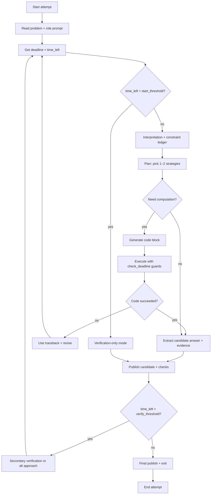
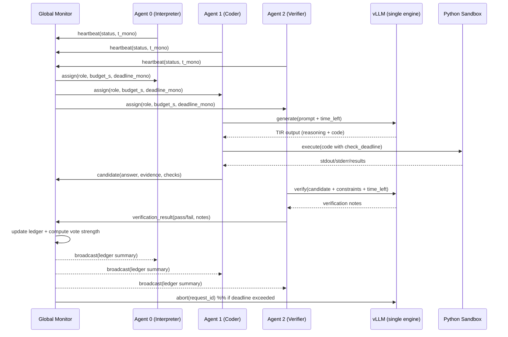

# Multi-agent, time-aware TIR architecture for GPT-OSS-120B solving AIMO-style problems

## Executive summary

A practical 16‑agent architecture for AIMO-style mathematics with tool-integrated reasoning (TIR) should be designed around *three invariants*: (a) **one monotonic time authority** that all agents trust, (b) **one GPU-serving boundary** (a single vLLM engine/server) that all agents share without starving each other, and (c) **auditable, enforceable deadlines** that can stop both generation and computation rather than merely “inform” the model. citeturn7search5turn3search0turn2search0

The most robust single-node pattern is a **global monitor + shared-state event bus**: a monitor coroutine owns the canonical deadline clock and state ledger; each solver agent runs as an asyncio task that periodically heartbeats and requests time budgets; the monitor can force cancellation via vLLM request abort (or by cancelling/closing streaming generators) and can cut off long Python computations via in-code guards and subprocess timeouts. citeturn2search0turn2search11turn7search5turn3search0

Because GPT-OSS-120B is trained to operate under the **OpenAI Harmony response format** and is documented to “only” work correctly with it, explicit time-left signalling must be injected using Harmony’s system/developer message structure (or an explicit tool such as `get_time_left`) and then enforced by the runtime regardless of whether the model follows the instruction. citeturn5view3turn5view2turn3search11

## Constraints and assumptions

GPT-OSS-120B is an open-weight Mixture-of-Experts model described by OpenAI as roughly 117B parameters with ~5.1B active parameters, intended to fit on a single 80GB accelerator such as an NVIDIA H100, with MoE weights post-trained/packaged in MXFP4. citeturn0search9turn5view3turn0search2

OpenAI’s documentation and reference repository emphasise that the model is trained with the **Harmony response format** and “should only be used with this format,” and the Harmony guide defines a strict hierarchy of roles (system > developer > user > assistant > tool), multiple assistant channels (analysis/commentary/final), and specific handling rules for tool-calling and reasoning traces across turns. citeturn5view3turn5view2turn3search12

vLLM’s throughput/latency behaviour is strongly shaped by scheduling details: chunked prefill (enabled by default in vLLM V1 when possible) changes whether prefills and decodes interleave, and parameters like `max_num_batched_tokens` and `max_num_seqs` directly influence inter-token latency (ITL), time-to-first-token (TTFT), and overall GPU utilisation; long prefills near the context limit can still cause visible “blocking” and latency spikes if token budgets are mis-tuned. citeturn3search0turn0search5turn3search6

Assumptions (explicit because you did not pin these): (i) all 16 agents run on a single host with one GPU and one vLLM instance; (ii) agents do not have internet access, so time must be derived locally; (iii) the IPC mechanism is a design choice (shared memory queues, local sockets, or multi-process), not predetermined by the environment; and (iv) the TIR sandbox is a standard Python/Jupyter environment where you can run asyncio and subprocesses. citeturn7search5turn5view2

## Timers and monitoring architecture patterns under vLLM and H100 constraints

Accurate countdowns without internet should be based on a **monotonic clock** (not wall-clock time) because wall clocks are not guaranteed to be monotonic and can move backwards under time synchronisation or other adjustments; Python’s asyncio design explicitly allows event-loop time to be monotonic with an unspecified epoch, and the standard guidance is to interpret only time *differences* (durations) as meaningful. citeturn7search5turn6search4turn7search10

On a single node, the most reliable “timer architecture” is therefore **monitor-owned deadlines**: the monitor sets `problem_deadline = t0 + budget_s` in monotonic seconds, and each agent derives its local `time_left = max(0, deadline - now)` from the monitor’s reference to avoid per-agent drift and inconsistent “50s left” messages. citeturn7search5turn7search10

### Core monitor patterns

A **heartbeat loop** (agent → monitor) is the simplest liveness signal: agents periodically publish (`agent_id`, `problem_id`, `phase`, `now_mono`, `time_left_est`, optional “I am stuck” flags) and the monitor flags stalls if heartbeats stop arriving; this is the single-node analogue of classical failure-detection services (including heartbeat and accrual failure detectors), adapted here mainly to catch deadlocks, runaway tool loops, and “agent stopped responding” conditions. citeturn7search12turn7search1turn7search6

A **shared-state ledger** (monitor-owned) should represent the *canonical* state of each agent and each problem: current phase (interpretation / planning / coding / verification), deadline, tokens generated so far (if accessible), last tool call time, last heartbeat, and best candidate answer(s) with justification tags; this matches the general “orchestrator + gates” pattern recommended in agent systems where intermediate checks maintain control and transparency. citeturn4view0turn5view2

### vLLM scheduling and GPU contention considerations

With 16 simultaneous solver agents on one H100, the primary systems risk is **GPU head-of-line blocking** from long prefills and KV-cache pressure, not “async overhead” in Python; vLLM explicitly warns that long prompts near context limits cause compute-bound prefills that can slow other requests, and recommends tuning `max_num_batched_tokens` to balance decode responsiveness (ITL) vs TTFT/throughput. citeturn3search6turn3search0

Chunked prefill changes scheduling policy to prioritise decode requests and interleave prefills when token budget remains; this typically improves ITL and GPU utilisation by mixing compute-bound (prefill) and memory-bound (decode) work in the same iteration, but it still requires mindful settings so that one agent’s huge prefill does not dominate token budget. citeturn3search0turn0search0

vLLM’s optimisation docs describe KV-cache preemption behaviour (including V1’s default preemption mode `RECOMPUTE`) and list mitigation levers: adjust `gpu_memory_utilization`, reduce `max_num_seqs`/`max_num_batched_tokens`, or change parallelism; for a single H100 “many agents” run, your monitor should treat “preemption warnings” as a first-class signal that you are overcommitting concurrency. citeturn3search1turn3search0

Although NVIDIA’s H100 marketing materials highlight large performance gains (including FP8/Transformer Engine) and high inference capability, practical multi-agent throughput still bottlenecks on batching efficiency and KV-cache management; NVIDIA’s own MoE performance write-ups for Mixtral on H100 show that lower precision (e.g., FP8) can substantially increase throughput, reinforcing that precision/quantisation choices affect both latency and agent parallelism headroom. citeturn6search14turn6search6

### Candidate architectures comparison table

| Candidate architecture | Complexity | Latency | Robustness | Implementation effort | Suitability for 16 agents on one H100 |
|---|---|---|---|---|---|
| Shared-memory monitor (single process asyncio; queues + dict ledger) | Low | Lowest (no IPC beyond in-process queues) | High for single-node; fewer moving parts | Low | Best default: maximises simplicity and minimises overhead |
| Message-broker (multi-process; local broker such as ZeroMQ/Redis/NATS; agent processes) | Medium–High | Low–Medium (IPC serialization, context switching) | High if broker is stable; isolates crashes | Medium–High | Good if you need strong isolation between agents or want to restart agents independently |
| CRDT-based peer-to-peer (agents replicate ledger via gossip + CRDT merges) | High | Medium (gossip + merge costs) | Very high under partitions/failures; eventual convergence | High | Usually overkill on a single host; better for multi-node scaling or fault isolation |

The trade-off between message broker and CRDTs is fundamentally about consistency under failures: CRDTs are designed to converge under concurrent, unsynchronised updates (strong eventual consistency), while broker-based designs emphasise operational simplicity with central ordering. citeturn6search0turn6search1

## Agent roles and communication protocols

AIMO‑style solving naturally matches the “parallelisation + voting” pattern (many independent attempts aggregated) and can be extended toward “orchestrator-workers” where a monitor/leader allocates specialised subtasks and synthesises results; Anthropic’s field guidance explicitly identifies these patterns as common, composable building blocks and recommends “gates” (programmatic checks) to keep multi-step processes on track. citeturn4view0turn1search1

### Recommended role set for 16 attempts

A pragmatic role allocation (still 16 “attempts,” but not identical) is: a small subset of **interpreters** (force multiple readings and extract constraints), **constructors** (focus on non-standard constructions), **coders** (rapid brute force + invariant hunting), **verifiers** (only check candidate answers/constraints), and **fallback reasoners** (pursue an alternative approach if coders stall); this is an engineered way to induce diversity beyond temperature alone, aligning with competition practice where self-consistency and tool-interaction are used to tame variance. citeturn1search1turn2search10turn4view0

### Communication pattern

A two-layer protocol works well:

**Publish/subscribe topics** for low-friction broadcasting:
- `heartbeat/{problem_id}` (agent → monitor),
- `candidate/{problem_id}` (agent → monitor + all agents),
- `alerts/{problem_id}` (monitor → agents),
- `ledger/{problem_id}` (monitor → agents snapshot updates).

**Direct messages** for targeted coordination:
- agent → agent: “try interpretation B” or “please verify candidate 48213,”
- monitor → agent: “budget cut to 20s” or “stop coding; switch to proof/verification.”

This matches agent-system advice that complex frameworks are less important than clean interfaces and composable patterns; here, you want “simple message primitives” that you can log and replay. citeturn4view0turn7search5

### Message format

A minimal JSON-serialisable schema that prevents ambiguity and aids auditing:

```json
{
  "msg_id": "uuid",
  "problem_id": "int-or-str",
  "agent_id": "0..15",
  "role": "interpreter|coder|verifier|...",
  "kind": "heartbeat|plan|candidate|evidence|alert|abort|request_help",
  "t_mono": 12345.678,
  "deadline_mono": 12395.678,
  "time_left_s": 50.0,
  "payload": { "text": "...", "answer": 48213, "checks": ["bf_n<=7_ok"], "confidence": 0.62 },
  "requires_ack": false
}
```

Embedding both `deadline_mono` and `time_left_s` reduces failure modes where local clocks diverge or agents recompute time-left incorrectly; a single authoritative deadline value enables deterministic reconciliation. citeturn7search5turn6search4

### Sync vs async and failure modes

Synchronous coordination (barriers, “wait for all 16”) maximises deadlock risk and wastes GPU time if one agent stalls; asynchronous coordination with soft deadlines (“publish best-so-far every 10s”) is more robust under heterogeneous agent latencies and aligns with the core multi-agent trade-off: you are buying diversity, not perfect consensus. citeturn4view0turn3search0

Key failure modes to design against:

- **Deadlocks**: agents awaiting each other’s verification before publishing any candidate; mitigate by requiring publish of provisional candidates and allowing monitor overrides. citeturn4view0  
- **Race conditions**: multiple agents “overwrite” the shared best answer; mitigate with monitor-owned ledger and append-only candidate logs. citeturn6search0turn6search4  
- **Clock drift / inconsistency**: agents disagree on “time left”; mitigate by monotonic deadlines distributed by the monitor. citeturn7search5turn6search4  
- **GPU starvation**: long prefills or too many sequences cause ITL spikes and preemptions; mitigate by tuning `max_num_batched_tokens`, limiting context growth, and reducing concurrent sequences when preemption warnings rise. citeturn3search0turn3search1turn3search6  
- **Cancellation gaps**: if you rely on client disconnects to abort generation, edge cases exist (e.g., server middleware bug reports); mitigate by explicit abort APIs where possible. citeturn2search0turn2search8  

## TIR integration and surfacing time-left via Harmony and tools

Harmony defines where “authoritative” meta belongs: system messages carry model meta/tool definitions and reasoning effort; developer messages contain what most people call the “system prompt” plus function-tool definitions; tool calls are expected on the commentary channel, and prior reasoning traces must be handled carefully across turns (especially when tool calling is active). citeturn5view2turn3search11turn3search12

### How to make time-left visible to the model

Use at least two of these channels simultaneously so that time awareness survives partial prompt truncation and model lapses:

**Inject time-left into the developer instruction block (recommended)** as a short, frequently refreshed line such as “Time remaining in this attempt: 50 seconds,” because developer instructions are high in the hierarchy and are explicitly intended for behavioural constraints. citeturn5view2turn3search12

**Provide a tiny function tool `get_time_left()`** that returns `{time_left_s, hard_deadline_s, phase_budget_s}` so the model can query it mid-solution, which is especially useful when solutions include long code-writing segments; Harmony’s guidance for tool definitions emphasises strict formatting for accuracy. citeturn5view2turn3search11

**Expose time-left to the Python sandbox** (e.g., `TIME_LEFT_S` and `deadline_mono`) and require that any generated code calls `check_deadline()` in loops; this leverages the TIR principle that environment feedback is ground truth for progress control. citeturn2search10turn4view0

### Enforcing time-left at the runtime boundary

Time-left prompting is necessary but not sufficient because models sometimes ignore constraints; the runtime must enforce deadlines by *cancelling generation* and *cutting off long computations*. citeturn4view0turn2search0

For generation: vLLM’s Python async engine exposes an explicit `abort(request_id)` mechanism (and related “abort requests” facilities in newer internals), which you can call when an agent exceeds its time slice, rather than waiting for the request to finish naturally. citeturn2search0turn2search11

For tool code: in a Jupyter sandbox, you generally cannot safely preempt arbitrary Python bytecode without cooperation; therefore you should enforce deadlines via (i) cooperative checks inside loops, (ii) timeouts around awaited coroutines, and (iii) subprocess isolation for untrusted heavy computations (so the monitor can terminate the subprocess). citeturn7search5turn4view0

### Example Harmony system/developer snippet exposing time-left and role

Below is a *template*, not a full spec: you should generate it through the Harmony renderer library to ensure correct tokens and tool stubs, as OpenAI recommends. citeturn3search11turn5view3

```text
<|start|>system<|message|>You are ChatGPT, a large language model trained by OpenAI.
Knowledge cutoff: 2024-06
Current date: 2026-03-04

Reasoning: high

# Tools
## python
## browser
# Valid channels: analysis, commentary, final. Channel must be included for every message.<|end|>

<|start|>developer<|message|># Instructions
You are SolverAgent-07 (role: verifier).
Time remaining for this attempt: 50 seconds.
Hard stop at: T+50s; if time_left < 10s, switch to verification-only and publish best candidate.

# Tools
## functions
namespace functions {
// Returns remaining time and deadlines for this agent.
type get_time_left = () => any;
} // namespace functions<|end|>
```

This aligns with Harmony’s separation: system holds meta and built-in tools; developer holds behavioural constraints and function tools. citeturn5view2turn3search11

## Time-aware planning and dynamic budget control

The winning AIMO Progress Prize 1 write-up describes SC‑TIR as a multi-round procedure that samples multiple candidates, executes Python blocks, feeds back outputs/tracebacks, and repeats for multiple rounds, with explicit pruning and majority voting; this is a strong prior that “multi-attempt + tool feedback” works, but it also implies that *time budgeting across rounds and candidates* is central to success. citeturn1search1turn1search5

### Progressive effort allocation

A robust time-aware plan is to split each agent’s budget into phases:

- **Interpretation & constraints** (front-load): short, high-leverage; publish ambiguity notes early.  
- **Search/coding** (mid): bounded exploration with explicit pivot triggers.  
- **Verification & consolidation** (end): mandatory; publish candidate + checks even if incomplete.

This maps to agent-design advice to add “gates” and stopping conditions in multi-step systems, and it directly mitigates common “timeout spiral” behaviour in tool-based maths solving. citeturn4view0turn2search10

### Early-exit and early-commit heuristics

Your monitor can implement “early commit” rules such as:

- Commit if ≥K agents independently produce the same 5‑digit answer **and** at least one verifier agent confirms constraints with explicit checks.
- Stop remaining agents when the marginal value of more samples is low (vote concentration high), reallocating GPU time to unsolved problems or to verification passes.

This is the multi-agent analogue of “voting” workflows and reduces wasted decoding time once consensus becomes strong. citeturn4view0turn1search1

### Dynamic reallocation via a meta-agent

A meta-agent (or the monitor using heuristics) can reallocate budgets based on live telemetry:

- If an agent is producing long prefills and raising ITL for others, cut its token budget or reduce its context growth (to reduce prefill dominance). citeturn3search6turn3search0  
- If KV-cache preemption warnings appear, reduce concurrent active agents (`max_num_seqs` effective usage) or shorten per-agent contexts to avoid recomputation overhead. citeturn3search1turn0search5  
- If a promising candidate emerges early, divert agents into verification mode rather than spawning more exploratory code.

The principles here match “simple composable patterns” and explicit planning transparency advocated in production agent guidance. citeturn4view0

## Safety, verification, and auditability

Even when you show time-left to the model, you should assume instruction non-compliance can occur; production agent guidance stresses guardrails and clear stopping conditions, which in this setting means your runtime must be able to stop generation and compute deterministically. citeturn4view0turn2search0

### Preventing agents from ignoring timers

A practical enforcement stack is:

- **Hard deadline at the orchestrator**: cancel/abort model generation when time is up. citeturn2search0turn2search11  
- **Soft deadline warnings**: monitor broadcasts “time_left<10s” alerts; agents switch to publish/verify mode. citeturn4view0  
- **In-code deadline guards**: generated code must call `check_deadline()`; loops must be structured to yield/exit. citeturn7search5turn2search10  

### Preventing timeout spirals and tool runaway

Adopt explicit *pivot policies* (monitor-enforced): after N consecutive timeouts or N failed code executions, the agent must stop coding and publish a minimal mathematical summary plus the best partial candidate; this mirrors the AIMO SC‑TIR notion of pruning and limiting interaction rounds to stay within time. citeturn1search1turn2search10

Additionally, implement **tool-call rate limits** and **max rounds** per agent: Harmony explicitly supports multi-turn tool interaction, but long tool loops can consume the entire attempt if you do not cap them. citeturn5view2turn2search10

### Audit logs and reconciliation traces

Maintain an append-only audit log per problem:

- every message (agent→monitor, monitor→agent),
- every model request (prompt hash, sampling params, token limits),
- every tool execution (code, stdout/stderr, runtime, timeout reason),
- every candidate answer and verification check outcome.

This provides the “transparency” that agent guidance recommends, and it creates the dataset you need to debug systematic failures (e.g., incorrect interpretations) and to tune vLLM scheduling parameters empirically. citeturn4view0turn3search0

## Implementation sketches, mermaid diagrams, and evaluation metrics

### Per-agent lifecycle timeline flowchart (mermaid)



### Agent interaction diagram with global monitor (mermaid)



### Pseudocode sketch: per-agent loop and global monitor

```python
# Assumption: single-process asyncio orchestration (shared-memory monitor).
# Swap the EventBus implementation if you choose broker / multi-process.

import asyncio
import time
from dataclasses import dataclass, field
from typing import Any, Dict, Optional

@dataclass
class AgentState:
    agent_id: int
    role: str
    problem_id: str
    deadline_mono: float
    last_heartbeat_mono: float = 0.0
    phase: str = "init"
    best_candidate: Optional[int] = None
    best_evidence: Dict[str, Any] = field(default_factory=dict)
    aborted: bool = False

class EventBus:
    def __init__(self):
        self.pub = asyncio.Queue()

    async def publish(self, msg: Dict[str, Any]) -> None:
        await self.pub.put(msg)

    async def subscribe(self):
        while True:
            yield await self.pub.get()

def mono_now() -> float:
    return time.monotonic()

def time_left(deadline_mono: float) -> float:
    return max(0.0, deadline_mono - mono_now())

async def agent_loop(state: AgentState, bus: EventBus, llm_client, sandbox):
    # llm_client and sandbox are assumed interfaces (inference + python exec).
    # They are placeholders because the exact API depends on your integration.
    while not state.aborted:
        tl = time_left(state.deadline_mono)
        await bus.publish({
            "kind": "heartbeat",
            "agent_id": state.agent_id,
            "problem_id": state.problem_id,
            "t_mono": mono_now(),
            "time_left_s": tl,
            "phase": state.phase,
        })
        if tl <= 0:
            break

        # Phase policy (simplified)
        if tl < 10:
            state.phase = "verify_only"

        prompt = build_harmony_prompt(problem_id=state.problem_id,
                                     role=state.role,
                                     time_left_s=tl)
        try:
            # Hard cap generation time to avoid overrunning.
            resp = await asyncio.wait_for(llm_client.generate(prompt), timeout=min(8, tl))
        except asyncio.TimeoutError:
            state.phase = "timeout"
            continue

        # If resp contains code blocks, run with cooperative deadline checks.
        result = await sandbox.execute(resp, deadline_mono=state.deadline_mono)

        candidate = extract_candidate_int(result)
        if candidate is not None:
            state.best_candidate = candidate
            state.best_evidence = {"result": result, "time_left_s": tl}
            await bus.publish({
                "kind": "candidate",
                "agent_id": state.agent_id,
                "problem_id": state.problem_id,
                "t_mono": mono_now(),
                "time_left_s": tl,
                "answer": candidate,
                "evidence": state.best_evidence,
            })

        # Yield to allow other agents + monitor to run
        await asyncio.sleep(0)

async def monitor_loop(states: Dict[int, AgentState], bus: EventBus, llm_abort_fn):
    # llm_abort_fn(request_id) is assumed; in vLLM async engine you can abort by request_id.
    HEARTBEAT_TIMEOUT_S = 5.0
    while True:
        msg = await bus.pub.get()

        kind = msg.get("kind")
        aid = msg.get("agent_id")
        if aid is None:
            continue

        st = states[aid]
        if kind == "heartbeat":
            st.last_heartbeat_mono = msg["t_mono"]
            # Enforce deadline
            if msg["time_left_s"] <= 0 and not st.aborted:
                st.aborted = True
                await bus.publish({"kind": "abort", "agent_id": aid, "problem_id": st.problem_id})

        elif kind == "candidate":
            # Update ledger and optionally broadcast a summary
            pass

        # Liveness check (periodic, simplified)
        now = mono_now()
        for s in states.values():
            if not s.aborted and (now - s.last_heartbeat_mono) > HEARTBEAT_TIMEOUT_S:
                s.aborted = True
                # Optional: abort any in-flight generation for that agent via llm_abort_fn
```

The key technical point is that `time.monotonic()` is the correct basis for deadlines and countdowns in Python-style async systems, because monotonic clocks cannot go backwards and are the basis for asyncio timeouts by design. citeturn7search5turn7search10

### Architecture-specific note: aborting vLLM requests

If you integrate at the vLLM async-engine layer, the engine documents an explicit `abort(request_id)` path that is triggered on cancellation and can be invoked by your monitor to enforce deadlines; newer internals also include bulk abort facilities. citeturn2search0turn2search11

If you integrate through the OpenAI-compatible HTTP server, you should still design as if abort can fail in edge cases and ensure your monitor can (a) close streaming generators and (b) degrade gracefully if a request is not immediately cancelled; public issue reports show that cancellation semantics can be sensitive to server integration details such as middleware. citeturn2search8turn2search7

### Evaluation plan and metrics

A rigorous evaluation should separate **solver quality** from **systems overhead**:

Latency and deadline metrics:
- TTFT and ITL per agent under load (vary `max_num_batched_tokens`, `max_num_seqs`). citeturn3search0turn0search5  
- Deadline miss rate (fraction of attempts that overrun budget, and by how much). citeturn7search5  
- Abort effectiveness (time from “deadline exceeded” to “generation actually stopped”). citeturn2search0turn2search8  

GPU and scheduler health:
- Preemption event counts / warnings and correlation with concurrency settings. citeturn3search1turn3search0  
- Throughput stability when prompts get long (prefill dominance tests). citeturn3search6turn3search0  

Solution metrics:
- Ensemble accuracy vs a baseline (same model, same total tokens, but without monitor/time awareness). citeturn1search1turn4view0  
- Diversity: entropy of final answers across agents; number of distinct strategies reported (role-induced diversity). citeturn4view0  
- Verification coverage: proportion of final answers accompanied by explicit constraint checks. citeturn4view0turn2search10  

Overhead:
- CPU overhead of orchestration (event bus + logging) vs total runtime. citeturn7search5  

### Trade-offs and limitations

Context window growth increases prefill cost and can degrade multi-agent responsiveness; vLLM notes that very long prompts are compute-bound in prefill and can slow other requests, and “chunked prefill” plus token-budget tuning mitigates but does not eliminate the fundamental cost. citeturn3search6turn3search0

GPU contention is exacerbated by KV-cache pressure; when preemption triggers recomputation, the effective cost of “too many concurrent long contexts” can rise sharply, meaning your monitor may need to dynamically reduce concurrency or shorten prompts to protect total score. citeturn3search1turn3search0

Quantisation and precision settings affect both throughput and accuracy: OpenAI distributes GPT-OSS weights in MXFP4 and evaluates with that quantisation, and NVIDIA’s MoE inference discussions show precision choices can materially change speed; any architecture comparison should therefore report both “tokens/sec” and “score impact” under your exact quantisation stack. citeturn0search2turn5view3turn6search6

### Concise implementation checklist

- Implement a monotonic-time deadline authority in the monitor (`deadline_mono = t0 + budget_s`) and distribute only that canonical value to agents. citeturn7search5turn6search4  
- Keep a monitor-owned ledger (append-only candidates + latest best) and require agents to heartbeat at a fixed cadence. citeturn4view0turn7search12  
- Surface `time_left_s` to the model in the developer message (and optionally via a `get_time_left()` tool) and refresh it each generation round. citeturn5view2turn3search11  
- Enforce hard deadlines by aborting/cancelling vLLM requests (engine abort where possible) and by applying compute guards in the Python sandbox. citeturn2search0turn7search5  
- Tune vLLM for 16 concurrent agents by starting with conservative `max_num_batched_tokens` (decode-responsive) and adjusting based on ITL, TTFT, and preemption warnings. citeturn3search0turn3search1  
- Log everything (messages, prompts, tool executions, aborts) to enable post-mortem analysis and avoid “silent” deadline misses. citeturn4view0turn3search0